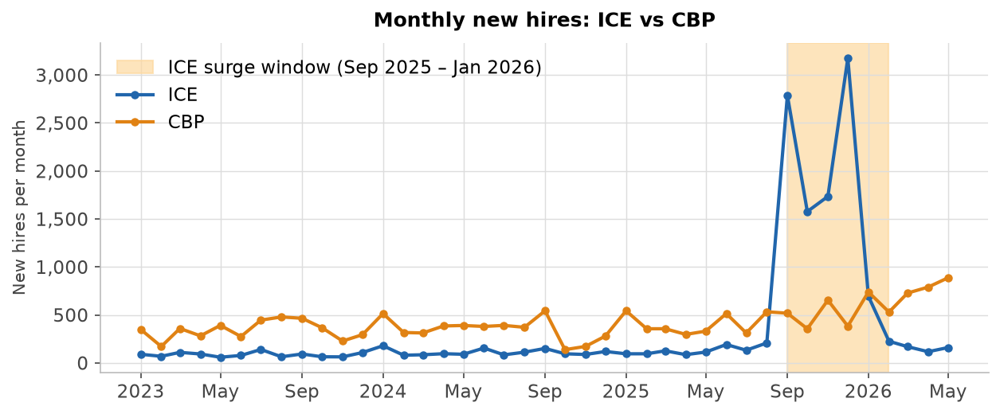
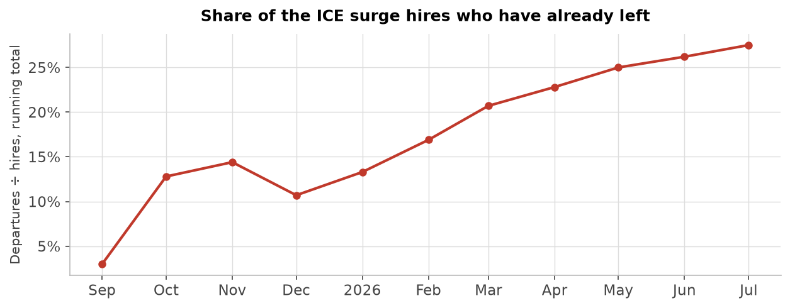

# ICE / CBP hiring-surge analysis (OPM EHRI)

Did the 2025 DHS hiring surge — especially at ICE and CBP — actually put officers on the payroll, and
are they staying? Built from OPM/EHRI records for hires, departures, and monthly headcount
(`impactproject/opm-ehri-data` on HuggingFace), read directly with DuckDB.

## Deliverables
- **`dhs_hiring_surge.ipynb`** — the analysis, start to finish (charts + tables inline).
- **`memo.md`** — one-page memo, every figure cross-referenced to a notebook section.

## Reproduce
```bash
pip install duckdb pandas matplotlib nbformat nbconvert jupyter
python src/extract.py          # pull the ICE+CBP slice (2018→) -> data/*.parquet
python src/history.py          # long-run 2006-2017 hiring + agency-code stability audit -> data/*.csv
jupyter nbconvert --to notebook --execute --inplace dhs_hiring_surge.ipynb
```

## Layout
- `src/extract.py` — DuckDB query over the HuggingFace parquet; caches a small ICE+CBP
  extract to `data/` (hires & departures 2018→, headcount 2022→).
- `src/history.py` — pulls 2006–2017 ICE/CBP new-hire history and a reproducible agency-code stability
  audit (`data/ice_cbp_hires_history.csv`, `data/agency_code_audit.csv`).
- `src/surge.py` — shared constants: ICE=`HSBB`, CBP=`HSBD`, the surge-hire profile
  (GL pay plan + job series 1801/1811), and the analysis windows.
- `data/hf_file_map.json` — deduped max-version HuggingFace file list the extracts read from (committed;
  `src/extract.py` and `src/history.py` read it but don't regenerate it). `data/*.parquet` are the
  extracts themselves — git-ignored, rebuilt by `python src/extract.py`.

## Method
Five things this leans on, checked live in the notebook's **§0**:

- **Files add, they don't restate.** OPM's monthly files are incremental — each one is mostly that
  month's actions plus a trickle of late-reported earlier ones (December 2025, the peak surge month,
  was only ~30% complete in its own file). A clean per-month series means summing across every file
  and grouping by when the action took effect, not by which file reported it — one file per month
  would badly undercount the surge.
- **Agency codes are stable and exclusive.** ICE = `HSBB`, CBP = `HSBD`, unchanged back to 2008.
  Lookalikes — USCIS (`HSAB`), DOJ immigration courts (`DJ12`) — are separate agencies and excluded.
- **Redaction hides values, not people.** A masked field (like work location) is relabeled, not
  dropped, so headcount and job totals still include everyone.
- **Surge hires are identified by job, not length of service.** The profile is pay plan `GL` + job
  series 1801/1811. Length of service mixes genuine new hires with rehires and veterans who arrive
  carrying years of prior federal credit, so it can't do this cleanly.
- **The departures we attribute to the surge cohort aren't mostly the ~1,500 people who already held
  these jobs before the surge, just leaving at their normal pace.** We can't prove that outright — there
  are no person IDs — but these jobs had a flat, low departure rate (27–46/year) for years before the
  surge, even as their headcount tripled. If that pre-existing group kept leaving at that same rate
  through the tracking window, it would explain only about 1–2% of what we count as surge-cohort
  departures, even at the high end. The rest has to be the surge hires themselves.

## Headline findings
The surge was overwhelmingly **ICE** (2025: ~8× normal hiring, ~5.3× ICE's all-time prior peak of 1,966 in
2009 — the 2017 "hire 10,000 officers" order produced nothing like it), concentrated in **Sept 2025–Jan
2026** in **entry immigration-enforcement officer roles** (series 1801/1811, GL plan). ICE headcount grew
~46% (20.9k→30.5k) then slipped ~5% by Jul 2026. The leavers are the surge hires themselves (see
Method for how we identify them), and **more than 1 in 4 has already left, ~69% by voluntary quit** —
before the cohort's first year is even up, already past what comparable CBP entry classes shed over a
*full* year (~10–11%), and closing on CBP's worst rapid-hire surges (~29% in 2019–21).



